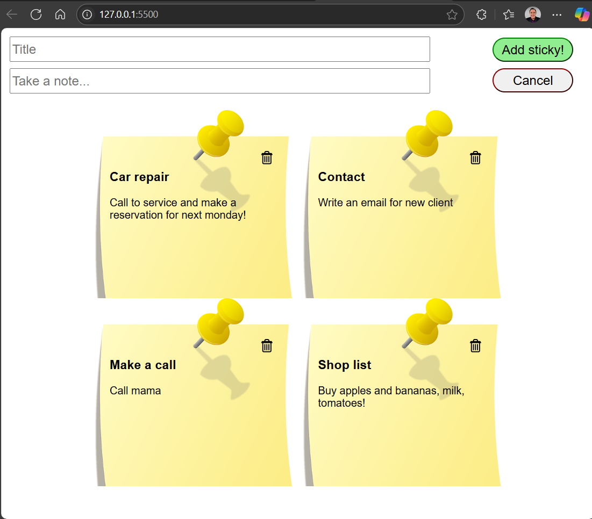

# 🗒️ StickyNotes

**StickyNotes** is a simple, responsive web app that allows users to jot down quick notes in the style of colorful sticky notes. Users can create, view, and delete notes through a minimal and interactive interface.

## 🚀 Features

- 📌 Add notes via an input field and "Add sticky!" button
- ❌ Remove individual notes with a single click
- 🧾 Notes displayed as sticky-note styled cards
- 📱 Responsive layout for mobile and desktop
- 🎨 Clean and colorful UI using background images and styled buttons

## 📸 Preview

 <!-- Replace this with the actual screenshot path or remove if not available -->

## 🛠️ Tech Stack

- **HTML5**
- **CSS3**
- **JavaScript (Vanilla)**

## 📁 Project Structure

sticky_notes/
├── index.html # Main HTML structure
├── styles.css # Styling for the app
├── script.js # JavaScript logic
├── img/
│ └── stickyNote.png # Sticky note background image
└── README.md # Project documentation


## ⚙️ How It Works

1. The user types a note into the input field.
2. On clicking **"Add sticky!"**, the note is added to the board.
3. Each note has a delete button (🗑️) allowing easy removal.

## 🎨 Styling Highlights

- Notes have a `stickyNote.png` background for a realistic look.
- Buttons and input fields are styled for usability and responsiveness.
- Responsive design ensures usability on all screen sizes.

## 📲 Responsive Design

The app adapts for screens under 600px wide:
- Input and buttons stack vertically
- Buttons stretch to full width for easier touch interaction

## 🔧 Installation & Usage

1. Clone the repository:
   ```bash
   git clone https://github.com/yourusername/sticky_notes.git

2. Open index.html in your browser:
  cd sticky_notes open index.html  # or just double-click it

3. Start taking notes!

## ✅ To-Do / Future Improvements

- Add persistent storage with localStorage
- Enable note editing
- Allow color customization for notes
- Add drag-and-drop functionality


  


